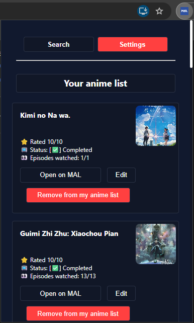
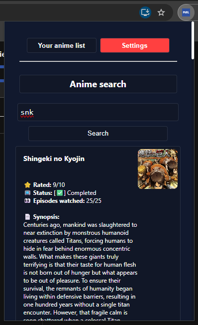
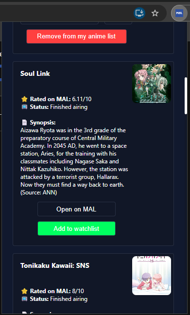
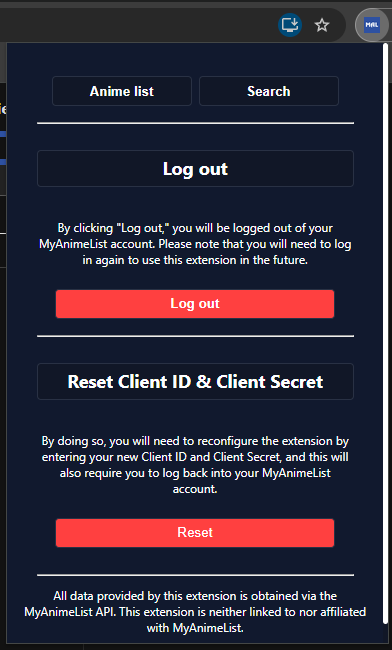
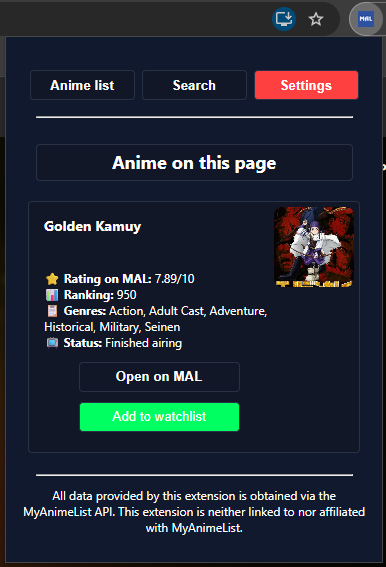
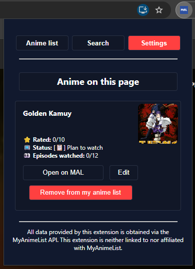
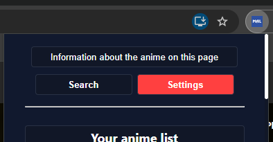

# MyAnimeList Dashboard

This extension allows for quick and easy use of your MyAnimeList anime list; features include a search bar, anime detection while browsing Crunchyroll, the ability to add anime directly from the Crunchyroll page or via the search tool, and the option to edit entries in your list.


## Installation on your browser

Available on Microsoft Edge and Google Chrome.

Aside from a necessary change to manifest.json, other issues render this extension unusable on Firefox.

#### Microsoft Edge
- Go to the following link: edge://extensions
- Enable "Developer mode" at the bottom left.
- Select "Load unpacked extension"
- Go to the folder containing the extension and click "Open".

#### Google Chrome
- Go to the following link: chrome://extensions
- Enable "Developer mode" at the top right.
- Select "Load unpacked extension"
- Go to the folder containing the extension and click "Open".
## Configuration

The extension will also guide you through this setup process when you use it for the first time.

- To configure this extension, you need to have a MyAnimeList account and visit the following link: https://myanimelist.net/apiconfig
- Next, click on "Create ID"
- Set the following parameters:
  - **App Name:** Choose what you would like.
  - **App Type:** web
  - **App Description:** Choose what you would like.
  - **App Redirect URL:** ```https://ongamdeehfnghjpbofhhipcebdbknmkh.chromiumapp.org/callback```
  - **Homepage URL:** Since you aren't actually creating a website, you can enter any URL you like, or the GitHub URL.
  - **Commercial / Non-Commercial:** Non-Commercial
  - **Name / Company Name:** Choose what you would like.
  - **Purpose of Use:** hobbyist or other
- Please accept the MyAnimeList API and Developer License Agreement and press "Submit"
- Your app now appears in the "Clients Accessing the MAL API" section. Select "Edit".
- Retrieve your client ID and client secret. The extension will require both to function when you start using it.
## Additional information

If you encounter any issues with the extension, please check the following:
- That the extension ID is indeed: ongamdeehfnghjpbofhhipcebdbknmkh
  - To retrieve the extension ID, please go to your browser settings to access your list of extensions. An "ID" field on the extension displays the extension ID.
  - If the extension ID differs from the one shown, open the "popup.js" file located in the "js" folder of the extension files. On line 4, change the value associated with "EXTENSION_ID" to the extension ID from your browser. Then, go to the following link https://myanimelist.net/apiconfig to edit your app, and in the "App Redirect URL" section, update the link to ```https://[extension_id].chromiumapp.org/callback``` (Without the brackets).
- Go to your browser settings to access your list of extensions. Find the extension in your list and click "Refresh".
- If you're on Crunchyroll, refresh your page.
- Open the extension, go to "Settings," and try to log out.
- Open the extension, go to "Settings," and press "Reset." In this case, you can still reuse the Client ID and Client Secret from the app created during the initial setup.

If nothing resolves your issue, please indicate it here, specifying the nature of the problem and how to reproduce it, if possible: https://github.com/Nyxielys/MyAnimeList-Browser-Extension/issues

You can also join my Discord: https://discord.gg/2x9juZp9VX
## Demo
#### Login Page


#### Main Page (Anime List)


#### Search Page




#### Settings Page


#### On a Crunchyroll anime page





- Adds a button to other pages that allows you to return to the information for the anime displayed on your page (image below).

